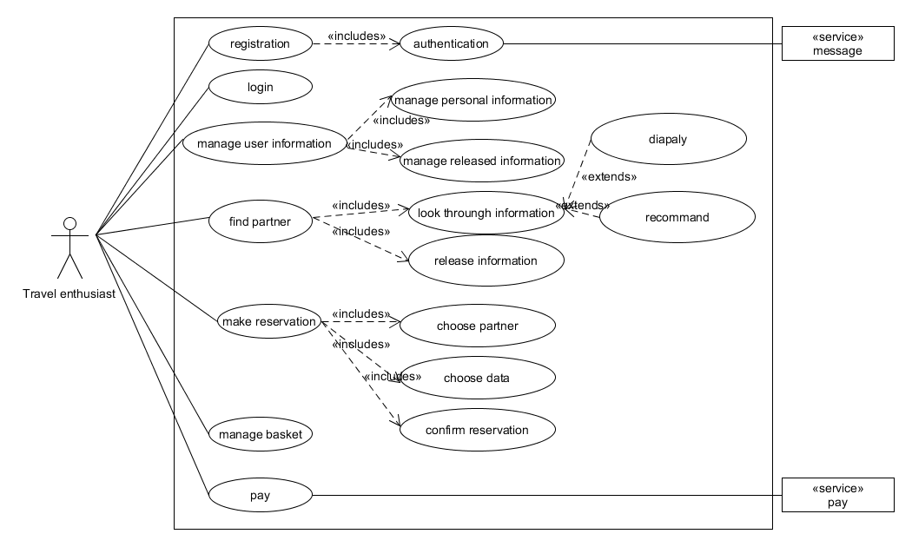
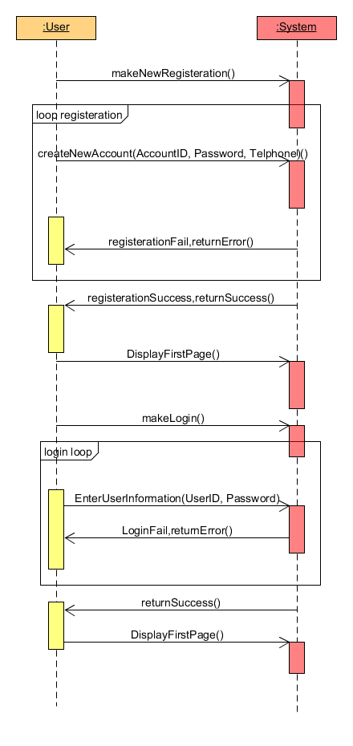
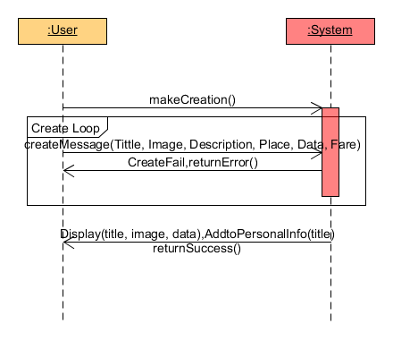
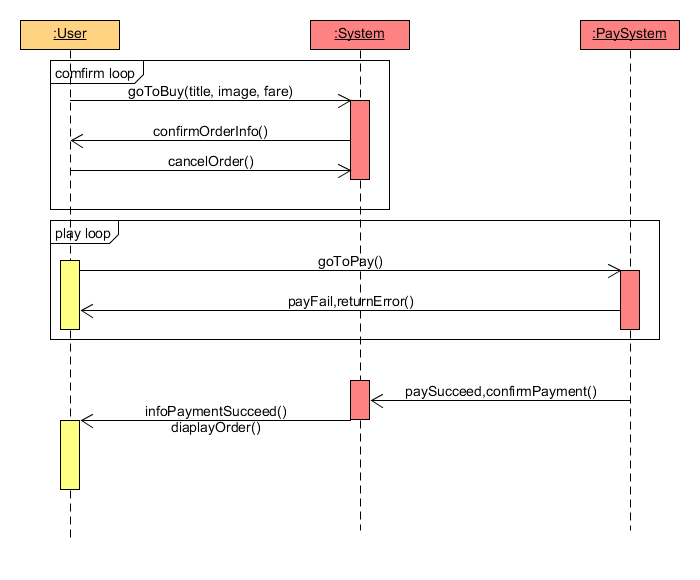
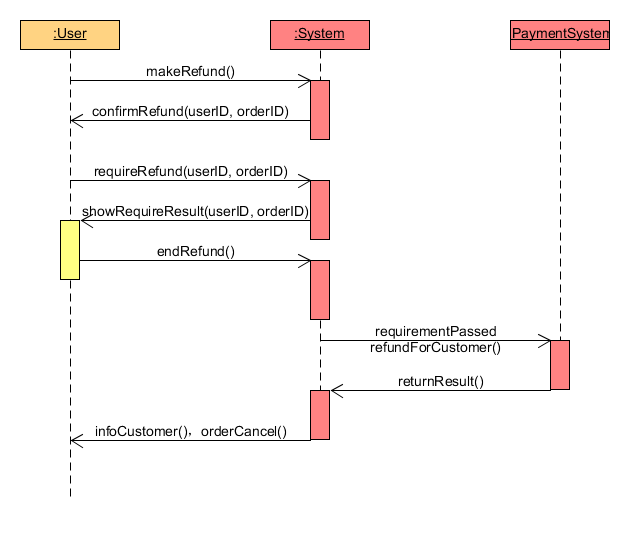
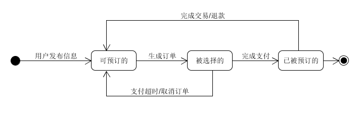
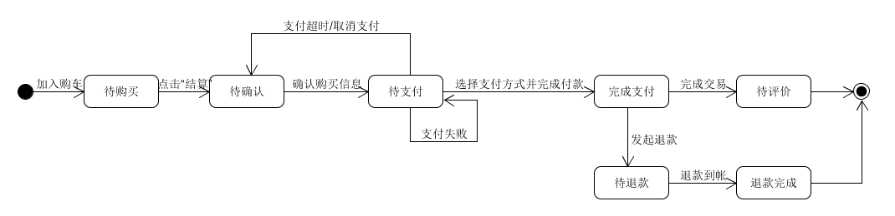

# 
软件需求规格说明书

## 1.引言
### 1.1 目的
编写此文档的目的是进一步定制软件开发的细节问题,希望能使本软件开发工作更具体。是为使用户、软件开发者及分析人员 对该软件的初始规定有一个共同的理解，它说明了本产品的各项功能需求、性能需求和数据要求，明确标识各功能的实现过程， 阐述实用背景及范围，提供客户解决问题或达到目标所需的条件或权能，提供一个度量和遵循的基准

### 1.2 项目背景
- 目标市场分析：根据国家旅游局的数据， 2015 年全国旅行社的利润总额同比减少了 34.14%。特别是国内游，千篇一律的所谓特色和毫不走心的服务都引起了人们的不满，游客通过旅行社进入景区的比例已经从 2010 年的 60%-70% 下降到 2015 年的 20%-30%。可见人们逐渐喜欢自由行，这对逛周自由行&租人的市场来说是有利的数据。中国旅游研究院（国家旅游局数据中心）发布的最新一部中国旅游经济蓝皮书《2016年中国旅游经济运行分析和2017年发展预测》（以下简称“报告”）指出，2016年我国旅游消费保持高速增长，2016年全年接待国内外旅游人数超过44.4亿人次，旅游总收入达到4.69万亿元。预计2017年国内旅游人数48.8亿人次，同比增长10%。说明旅游的市场前景非常大。

- 竞品分析：“逛周”面临的主要竞争对手主要有两类，一是面向社会大众的知识共享平台，包括“百度知道”、“知乎”等免费的问答社区以及“在行”、“靠我”等有偿经验分享平台。二是专注于学生的经验技能平台，包括“乐江湖”等技能经验交易平台和“大学必备网”等大学经验分享社区。我们将从产品、优势、劣势等方面对其进行全方位分析，帮助了解所处行业结构及竞争态势。所以，与旅游类app的竞争。我们可以发现目前市场上出现的旅游类app的功能很少有包含逛周租人的功能，大多是分布在旅行团，票务，和经验心得分享等，而租当地人来当导游的app在市面上比较少见。与租人app的竞争。可以看到当前市面上出现的租人app有两个问题，第一个是可能会处于法律的灰色地带，这是由理念和功能所碍，很多人就自然的用这种app来进行灰色交易；第二个有了需求是否要依靠app，像租我和闪电租人，都是生活中的琐事，例如打发无聊时间，有个小忙需要别人帮一下，而收费制很可能使用户麻烦朋友帮忙，而不是租人。而逛周，则是用户身处异国他乡想要找人做导游，很难找的到朋友，所以使用我们的app的概率就非常大

### 1.3 项目简介
   “逛周”是款旅游/技能租人的app。针对当前各城市景点趋于饱和的现状，也基于大家普遍不想走马观花式的旅游，通过当地人和游客的租赁，将当地最有地方特色的，最深层的文化，民俗或传统，让游客不只是观赏表层，还有体验和经历更深层次更能留的下记忆的旅游。
　 项目定位于喜欢旅游/在某地生活很长时间有见闻和自己的故事的人。主要人群分为两部分，一部分是租人，这牵扯的用户群是那些喜欢旅游的人，在旅游的途中，寻觅一当地人，与其聊聊当地的生活，体验当地的日常，学习当日传统的手艺，听听当地的故事，何等美哉，人，美景和故事，这才是旅游的真正意义；另一部分是出租，这牵扯到的用户群是本地长时间生活并且善于分享和带领别人体验的人，能把这个城市或这个地点的基本的故事和历史讲解清楚，并且分享自己的经历和感想，或者教授一些传统的记忆和体验。

### 1.4 参考资料
[1]Craig Larman 《UML和模式应用》
[2]潘茂林 《系统分析与设计课程内容》
[3] 衣杨 《系统分析与设计课程内容》

## 2. 任务概述
### 2.1 目标
项目需求细化，并编程实现不同的界面
- 实现“注册登录”板块：用户可以点击注册按钮进入注册页面，输入用户名、登录密码，在确认用户名没有重复、密码符合规范之后，提示用户注册成功。已经注册的用户可以点击登录按钮进入登录页面，输入正确的用户名和密即可登录成功。

- 实现“租人和出租”板块：包括查看租人和出租项页、租人项或出租项的详情页，用户可以浏览每日最新的出租项和租人项，同时点击某一项出租项或租人项时可以查看其详情。

- 实现“下单”板块：包括下单页、下单成功页。用户可以通过详情页的“去下单”按钮进入到下单页。下单成功后可以跳转到订单页。显示“支付成功”。

- 实现“打卡”板块：包括订单页地点打卡页，在达成的订单中，当天到场时可以进行一次地点打卡，代表已经到达，从而排除违约情况。

- 实现“发布”板块：包括发布页、发布页选择地点、发布成功页面，发布一个新的出租项或者租人项，要填写标题，详情，添加照片，选择地点，选择起止时间，填写价格及违约金，然后在发布页选择活动地点，发布成功后可以在出租列表里看到自己刚刚发布的内容。

- 实现“个人”板块：包括个人订单页、个人页，可以查看到所有订单，包括已支付，未支付，退款单等等，个人资料页可以进行个人设置，查看个人的收藏，评价，好友动态，客服等。

### 2.2 运行环境
软件平台：Android平台可正常运行

## 3.功能需求
### 3.1 Use Case图 

### 3.2 功能模型
**用例主场景一：用户登录注册** 

**用例主场景二：发布&展示信息** 

**用例主场景三：下单** 

**用例主场景四：退款** 

**操作契约**
- 契约一：createNewAccount 
	操作：createNewAccount(AccountID：int, Password:string, Telphone:int) 
	前置条件：用户正在注册 
	后置条件：创建一个新账号，将该用户的注册信息存入数据库 
  
- 契约二：EnterUserInformation 
	操作：EnterUserInformation(UserID:int, Password:string) 
	前置条件：用户正在登录 
	后置条件：核对数据库里已注册的用户信息 
  
- 契约三：createMessage 
	操作：createMessage(Tittle:string, Image:bitmap, Description:string, Place:string, Data:string, Fare:float) 
	前置条件：用户正在发布信息 
	后置条件：系统为该用户创建一条信息数据，将该信息写入数据库中，并将处理后的信息返回给用户 
  
- 契约四：Display 
	操作：Display(title:string, image:bitmap, data:string) 
	前置条件：用户确认发布信息 
	后置条件：按发布时间和分类展示在系统的不同位置 
  
- 契约五：confirmOrderInfo 
	操作：confirmOrderInfo(userID:int, orderID:long) 
	前置条件：用户正在确认订单 
	后置条件：系统确认订单并更改订单状态 
  
- 契约六：requireRefund 
	操纵：requireRefund(userID:int, orderID:long) 
	前置条件：用户正在发起退款 
	后置条件：经过系统审核后，返回请求结果，并更改订单状态 
  
### 3.3 状态模型
**发布信息状态图** 

**订单状态图** 

## 4.数据描述
**4.1 [用户及权限系统数据库设计](../documents/用户及权限系统数据库设计.pdf)** 
**4.2 [子系统数据库设计](../documents/子系统数据库设计.pdf)** 

## 5. 性能需求
### 5.1 事件特性
一般操作的响应时间应在1－2秒内

### 5.2 适应性
满足运行环境在允许操作系统之间的安全转换和与其它应用软件的独立运行要求

## 6. 运行需求
### 6.1 用户界面
采用app开发，所以按照app运行方式现实用户界面

### 6.2 软件接口
运行于Android系统下

### 6.3 故障处理
正常使用时不应出错，对于用户的输入错误应给出适当的改正提示。若运行时遇到不可恢复的系统错误，也必须保证数据库完好无损

