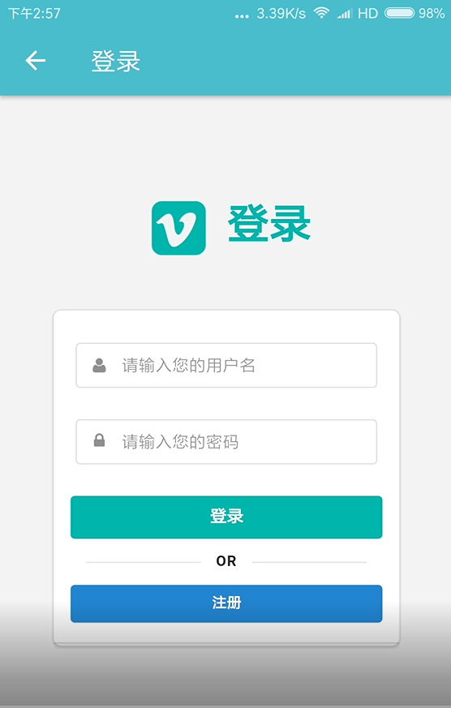
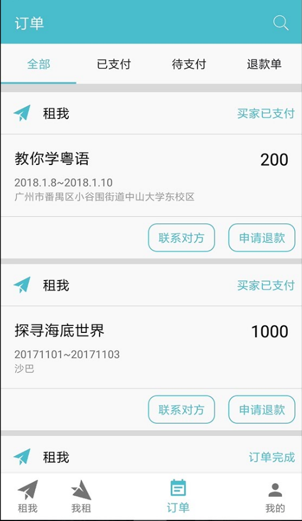
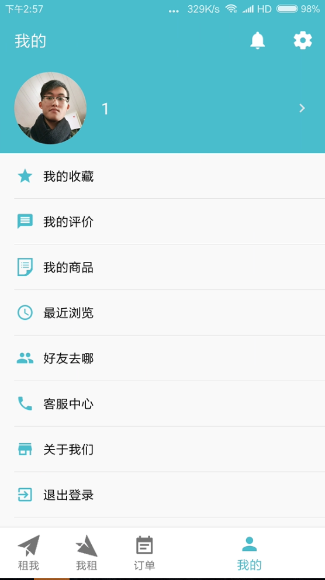
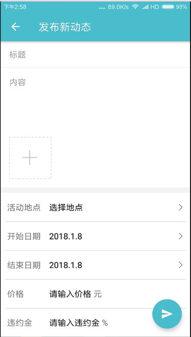
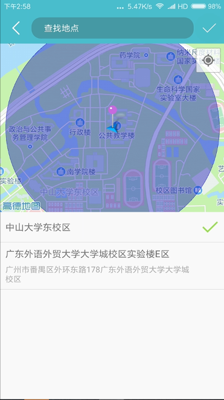
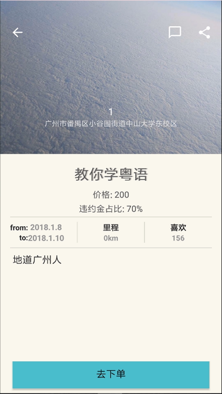
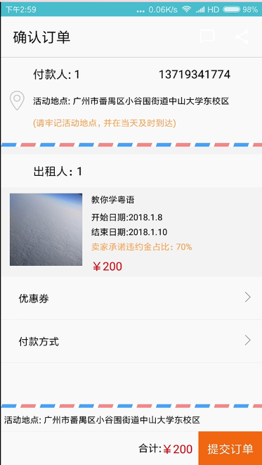
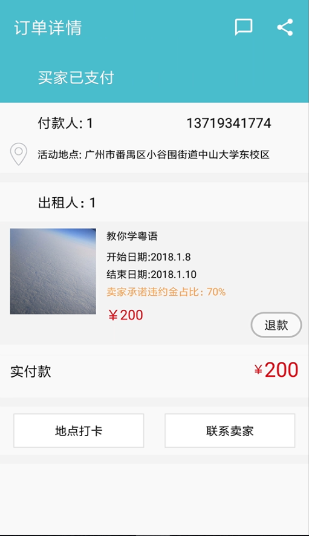
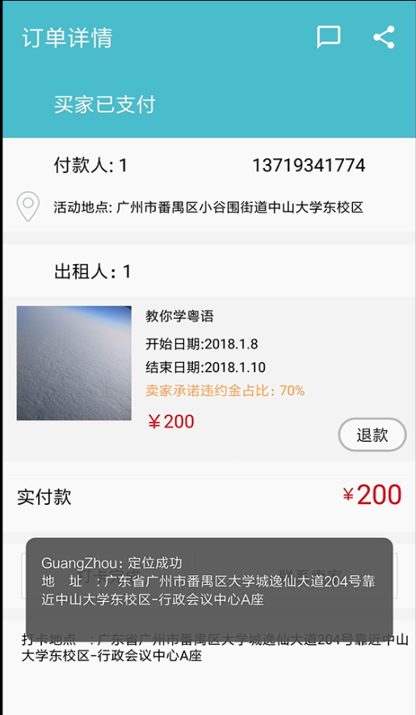

# 用户手册
## 1.引言
### 1.1编写目的
本文档编写的目的是充分叙述本软件所能实现的的功能及其运行环境，以便使用者了解本软件的使用范围和使用方法，并为软本件的接下来的开发提供必要的信息。

## 2.软件概述
### 2.1 软件用途
本软件——“逛周”是一款旅游/技能租人的app。 
本软件针对当前各城市景点趋于饱和的现状，也基于大家普遍不想走马观花式的旅游，通过当地人和游客的租赁，将当地最有地方特色的，最深层的文化，民俗或传统，让游客不只是观赏表层，还有体验和经历更深层次更能留的下记忆的旅游。项目定位于喜欢旅游/在某地生活很长时间有见闻和自己的故事的人。 
本软件将主要使用人群分为两部分，一部分是租人，这牵扯的用户群是那些喜欢旅游的人，在旅游的途中，寻觅一当地人，与其聊聊当地的生活，体验当地的日常，学习当日传统的手艺，听听当地的故事，何等美哉，人，美景和故事，这才是旅游的真正意义；另一部分是出租，这牵扯到的用户群是本地长时间生活并且善于分享和带领别人体验的人，能把这个城市或这个地点的基本的故事和历史讲解清楚，并且分享自己的经历和感想，或者教授一些传统的记忆和体验。
### 2.2 软件运行
本软件可以运行在android平台4.4版本及以上的手机上。       
### 2.3 安装部署配置
参照文档安装部署说明进行相应操作。

## 3 软件使用过程
### 3.1 运行步骤
直接从网址xxx下载安装包。
### 3.2 运行界面
- **注册与登录界面**：用户可以点击注册按钮进入注册页面，输入用户名、登录密码，在确认用户名没有重复、密码符合规范之后，提示用户注册成功。已经注册的用户可以点击登录按钮进入登录页面，输入正确的用户名和密即可登录成功。

- **查看租人和出租项**：用户可以浏览或发布每日最新的出租项和租人项。 
   
   **租人界面图-租我**：用户可发布自己能提供的各类服务（并赚钱）或浏览别人能提供的服务。

   **出租界面图-我租**：用户可发布自己想要租的各类服务（并提供佣金）或浏览别人想要的服务。

- **订单页面**：可以查看到自己上午所有订单，包括已支付，未支付，退款单等等。

- **个人页面**：个人资料页，可以进行个人设置，查看个人的收藏，评价，好友动态，客服等。

### 3.3 操作信息
本软件可以：1.用户注册登录，2.发布或浏览租人信息和出租信息，3.查看租人项或出租项的详情页，4.下单，5.订单打卡，6.查看个人订单，7.查看个人信息，这些主要操作

## 4.用户操作举例
### 3.1 用户注册登录

登录界面： 

已经注册的用户可以点击登录按钮进入登录页面，输入正确的用户名和密即可登录成功。 
用户也可以点击注册按钮进入注册页面，输入用户名、登录密码，在确认用户名没有重复、密码符合规范之后，提示用户注册成功。

### 3.2 发布或浏览租人信息和出租信息

“租我”，浏览别人发布的能提供的服务： 

“我租”，浏览别人发布的想要的服务： 

在“租我”页面，用户可点击屏幕右下角的“加号”，填写相关信息，发布自己能提供的各类服务（并赚钱） 
或者在“我租”页面，用户可点击屏幕右下角的“加号”，填写相关信息，发布自己需要的服务（并提供佣金）： 

选择地点时，本软件提供了地图选择地点的服务： 

发布成功后将显示在对应的界面中： 

### 3.3 查看租人项或出租项的详情页

点击“租我”或者“我租”页面中的具体项目，可以看到这些项目的具体内容（包括具体时间、地点、佣金/定价、具体服务内容等）： 

### 3.4 下单

浏览到心仪的租人项/出租项的之后，点击上图项详情页最下方的“去下单”按钮可以进入到确认订单页面： 

点击上图右下角的“提交订单”按钮，便下单成功，系统给出反馈界面： 

### 3.5 订单打卡

在达成的订单中，当天到场时可以进行一次地点打卡，点击上图已经下单成功界面左下角的“地点打卡”，代表已经到达，从而排除违约情况： 

### 3.6 查看个人订单

点击主界面下面标签栏第三个icon可以查看到用户的所有订单，包括已支付，未支付，退款单等等： 
 

### 3.6 查看个人信息

点击主界面下面标签栏最后一个icon,进入个人资料页，可以进行个人设置，查看个人的收藏，评价，好友动态，客服等： 

[个人页](../assets/UI/个人页.png)

以上。
